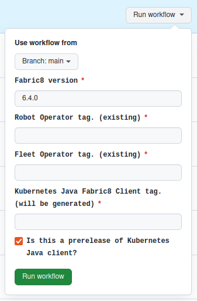

# Generating Models

Run the action [`Generate Java Fabric8 Model From CRD`](https://github.com/robolaunch/robot-client-java-fabric8/actions/workflows/generate-client.yaml).

You will see 6 inputs:

***Branch***: Choose `main`. Use other branches for only testing purposes.

***Fabric8 version***: Choose compatible Fabric8 version for your project. Versions after `6.5.1` are supported for now.

***Robot Operator tag***: The version of Robot Operator. See the [tag list](https://github.com/robolaunch/robot-operator/tags).

***Fleet Operator tag***: The version of Fleet Operator. See the [tag list](https://github.com/robolaunch/fleet-operator/tags).

***Connection Hub Operator tag***: The version of Connection Hub Operator. See the [tag list](https://github.com/robolaunch/connection-hub-operator/tags).

***Kubernetes Java Fabric8 Client tag***: Name of your future release. Use semantic versioning. Current format is `<MAJOR>-<ROBOT-OPERATOR-MAJOR>-<FLEET-OPERATOR-MAJOR>-<CONNECTION-HUB-OPERATOR-MAJOR>-<PRERELEASE-INDICATOR>.<MINOR>`. (eg. `0.1.0-0.2.5p-0.1.6p-0.1.7p-alpha.1`, minor `p` indicates prerelease of the component)

***Prerelease***: Mark your release as prerelease if one of the components from Robot Operator or Fleet Operator has unstable version.

Run the action. After it succeeds, another action (`Publish Maven Package to GitHub Packages`) that publishes Maven package to GitHub Packages will be triggered.